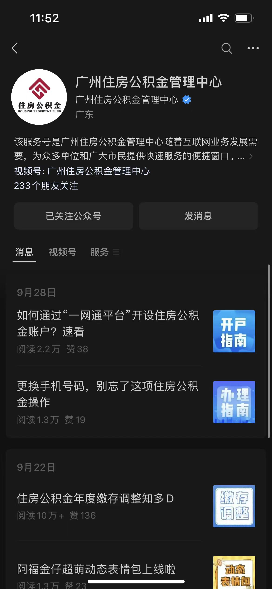
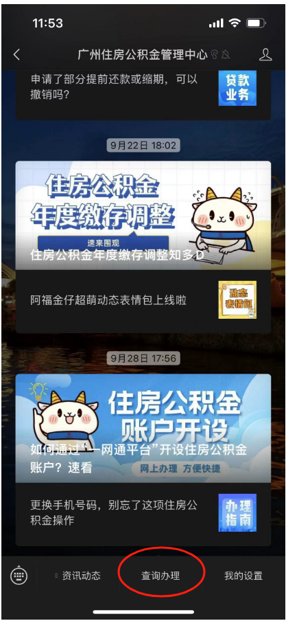
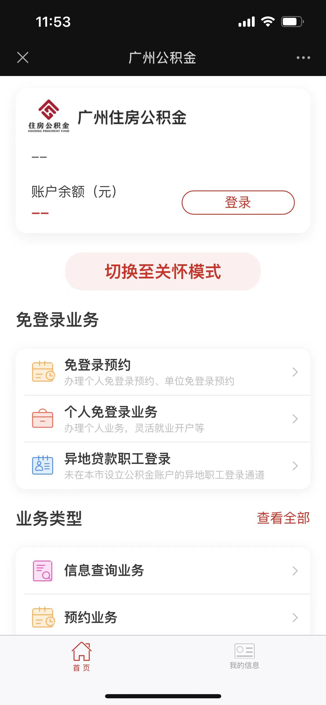
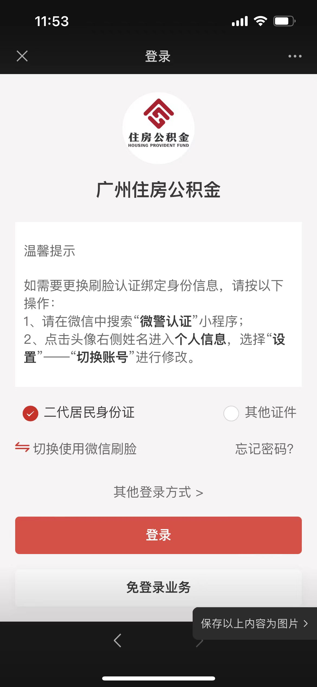
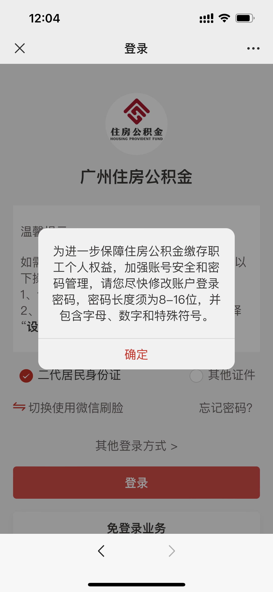
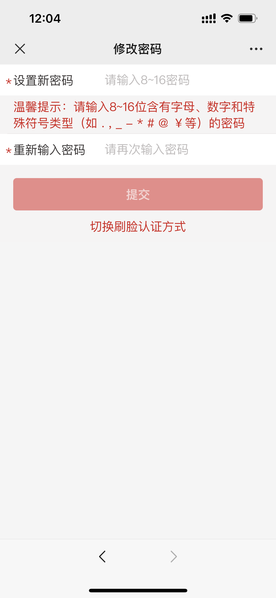
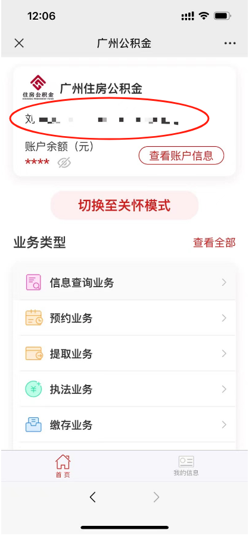
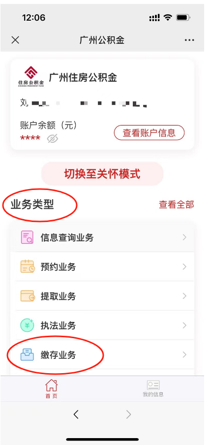
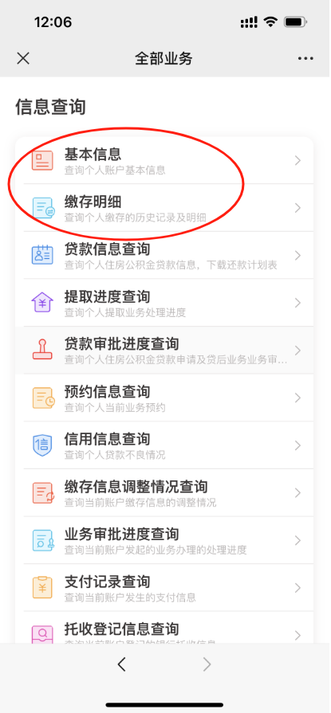

# 关于公司为员工缴纳住房公积金的通知（20231011邮件）
> 生成时间: 2026-02-13 17:32:44
> 来源: 飞书文档

Dear all：

    【特大好消息、特大好消息】

    公司为提高员工的福利待遇，于本月起，公司为员工缴纳住房公积金，单位和个人各自缴纳比例为5%，每月15号缴纳，预计1-2天到个人的公积金账户（如遇到节假日到账情况顺延）。

    PS：因涉及到薪酬福利保密，应彼此尊重和保护隐私,  特此要求大家杜绝私下讨论此事，若有疑问可向上级反馈, 谢谢大家配合！

**  ****以下是如何查询住房公积金的步骤（如有不明白之处，可咨询小敏/佳意）**

**1、关注微信公众号：广州住房公积金管理中心  ****     **

**                                     **

**2、点击-查询办理****            **

**                                                                           **

** 3、点击-登录**

**4、选择-二代居民身份证（刷脸登录）   ****       **

**                                      **

**5、如有出现提示需要修改密码请根据步骤操作（如无提示请忽略）**** **

**6、登录后请核对自己的信息（一般情况下不会有错）**

**7、点击-业务类型-缴存业务**

**                     **

**8、信息查询-可查询个人信息等情况**

**        **

**                                                 **

